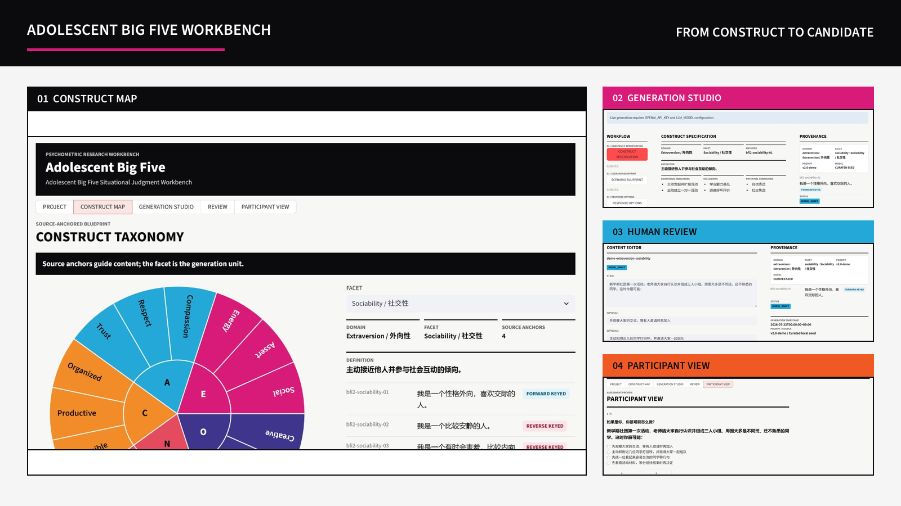
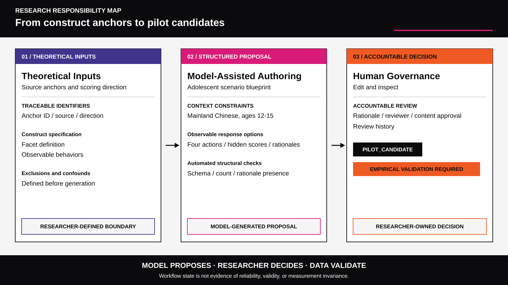
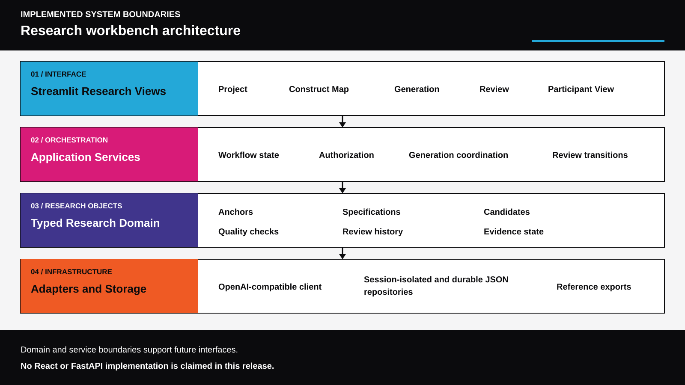

# Adolescent Big Five Workbench: Research Case Study

> A research and engineering case study for developing traceable situational judgement item candidates with mainland Chinese adolescents aged 12-15 as the intended research population.

## Executive Summary

The Adolescent Big Five Workbench is a working research prototype for the traceable, human-governed conversion of established Big Five anchors into situational judgement item candidates. It links each candidate to a defined construct, stages model-assisted authoring inside typed records and quality checks, and preserves review decisions for inspection. The model may propose a scenario, response options, scores, and rationales, but it cannot redefine the construct or replace theoretical, qualitative, or psychometric evidence. The public deployment is read-only for anonymous visitors, and anonymous browsing does not construct a model client or consume model tokens. The displayed reference content, generated candidates, workflow states, and interface together are not a validated assessment.

## Research Problem

Decontextualized self-report asks young respondents to summarize broad behavior without a concrete frame of reference. A situational judgement format instead presents an adolescent-recognizable event and asks what the respondent would most likely do. That concreteness may support comprehension and ecological interpretation, but format alone is not an advantage. A scenario can change the target construct, reward school achievement or cultural familiarity, introduce language demands, cue socially desirable answers, or confound a personality facet with opportunity, family context, peer status, or emotion regulation.

The research problem is therefore not simply to generate realistic stories. It is to make every interpretive step inspectable while treating the content as provisional. A workflow can improve consistency, construct traceability, and accountability; it cannot stand in for expert judgement, respondent evidence, or statistical validation. A plausible item and a successful software check do not show that respondents understand the item as intended.

## From the 2023 Master's Project to the Adolescent Workbench

The lineage begins with a 2023 master's project focused on college students. The original participant dataset is unavailable in the current repository, so this reconstruction makes no retrospective comparison, historical effect estimate, or unverified sample claim.

The present work changes the intended population to early adolescents and rebuilds the workflow around that choice. It adds anchor-linked provenance, explicit construct specifications, typed candidate records, staged authoring, automated checks, named human review, version history, evidence-state transitions, deployment boundaries, and a participant-facing preview. These changes document an inspectable engineering process; they do not establish better measurement. The lineage is project history and motivation, not comparative evidence.

## My Role: Researcher · System Designer · Developer

I contributed across three connected roles. As researcher, I framed the adolescent measurement problem, responsibility boundary, and validation requirements. As system designer, I defined the layered architecture, typed records, workflow states, traceability links, review history, and deployment boundary. As developer, I implemented the services, interface, checks, storage adapters, automated tests, release audit, and public preview. This combined role connects research assumptions to visible system behavior while retaining personal accountability for what the software does and does not demonstrate.

## Construct and Item-Development Method

The facet is the authoring unit. The current construct map covers five Big Five domains, 15 facets, and 60 anchors. Every anchor retains an identifier, wording, domain, facet, and keying direction. For each facet, a construct specification adds a Chinese definition, intended observable behaviors, exclusions, and likely confounds. This representation keeps the source and the operational interpretation visible rather than hiding them inside one prompt.

Given a selected anchor and adolescent context, the model proposes a scenario blueprint, four observable response options, hidden scores, and rationales. Pydantic schemas require a structured candidate, while automated quality checks examine option count, score structure, scenario constraints, and wording risks. The record retains generation metadata and researcher edits. These mechanisms can detect malformed or inconsistent artifacts and make review reproducible. They do not establish reliability, construct validity, fairness, or another measurement property.

## Human-AI Responsibility Boundary

The governing principle is simple: The model proposes; the researcher decides; data validate. Model scope is limited to producing and, when necessary, repairing structured authoring suggestions within a researcher-defined construct specification. It has no authority to change the intended facet, declare an item acceptable, infer an individual's personality, or assign evidence.

The researcher remains accountable for construct interpretation, adolescent appropriateness, confound analysis, edits, review rationale, ethics, and empirical use. Automated checks inform that judgement but do not replace it. Content approval is separate from promotion to `PILOT_CANDIDATE`: approval records a human content decision, while promotion marks only readiness for a future pilot. Neither status is validity, and state progression is not psychometric evidence.

## System Architecture

The implemented system has four layers. **Streamlit Research Views** provide Project, Construct Map, Generation, Review, and Participant View surfaces. **Application Services** coordinate authorization, generation, checks, workflow transitions, review actions, and reference downloads. The **Typed Research Domain** represents anchors, specifications, candidates, evidence states, quality results, and review history. **Adapters and Storage** connect an OpenAI-compatible client, session-isolated temporary JSON repositories for `public_demo`, durable local JSON repositories for `research`, and reference-only exports.

These boundaries keep research records and workflow rules separate from presentation and infrastructure. The service and domain layers could technically support a different interface in future. React and FastAPI are not implemented in the current workbench, so they are architectural possibilities rather than present capabilities.

## What the Current Workbench Demonstrates

The repository demonstrates an end-to-end, tested workflow from construct inspection through structured generation, checking, researcher editing, content approval, pilot-candidate promotion, and a participant-safe preview without construct labels, scores, rationales, or individual reports. Operational safeguards keep anonymous public access read-only, block model construction on locked paths, make public records ephemeral and session-isolated, provide durable research storage, and use a history-aware public-release audit to check reachable content for credential risks.

As a concrete doctoral or job-talk artifact, the workbench makes research reasoning, implementation choices, responsibility allocation, tests, and limitations inspectable in one system. That is an engineering and research-process contribution, not evidence of instrument performance.

## What Has Not Yet Been Validated

No claim is made here about reliability, validity, measurement invariance, superiority to another format or system, population norms, diagnostic meaning, or suitability for educational, clinical, employment, or other high-stakes decisions. Reference items demonstrate the workflow only. Candidate status does not authorize scoring, personality reporting, selection, placement, or individual-level inference.

Before research administration, the content requires structured expert review and cognitive interviews with adolescents, appropriate ethics review and participant safeguards, and a preregistered pilot. Subsequent analyses should evaluate item functioning and reliability; factor structure; convergent and discriminant validity; scenario and language effects; subgroup fairness; and measurement invariance across relevant demographic or linguistic groups. Any interpretation would need to follow the evidence produced by those stages, including null or adverse findings, rather than the confidence of a model or the completeness of the interface.

## Future Research Program

The next program begins with expert review, cognitive interviews, and a preregistered pilot, then compares situational and classic self-report formats under matched construct definitions. The comparison should test comprehension, response processes, factor structure, reliability, convergent and discriminant patterns, and fairness without presuming which format will perform better. Findings should feed back into item revision and a documented decision about further piloting.

Beyond the initial Big Five vertical, future studies may examine adolescent individual differences in relation to executive function, psychopathology-related phenotypes, and longitudinal development. Carefully governed links with neuroimaging may eventually become research questions where theory, ethics, sampling, and measurement quality justify them. These are future directions, not present features. The immediate priority is to establish whether adolescents interpret the scenarios as intended and whether responses support defensible psychometric models.
