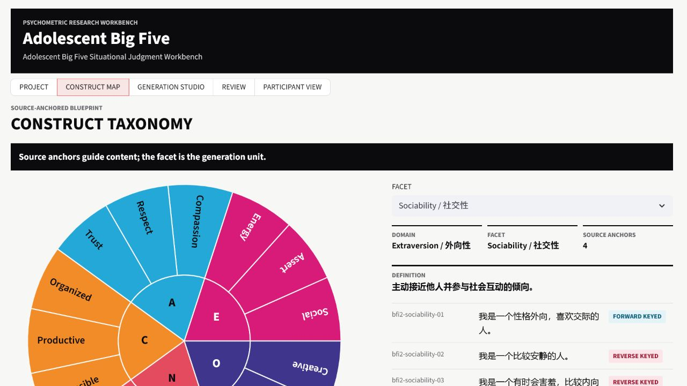
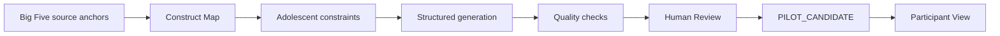
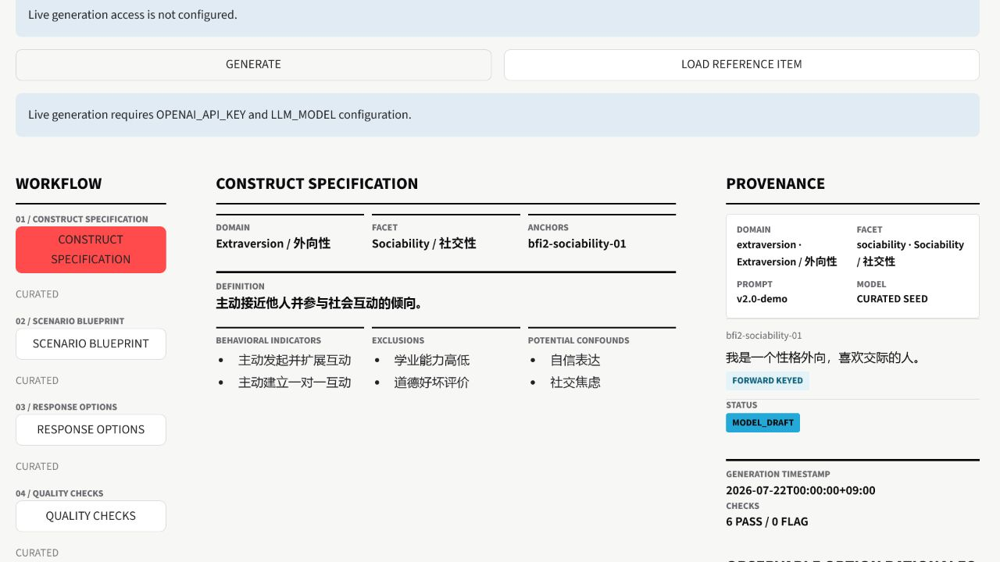
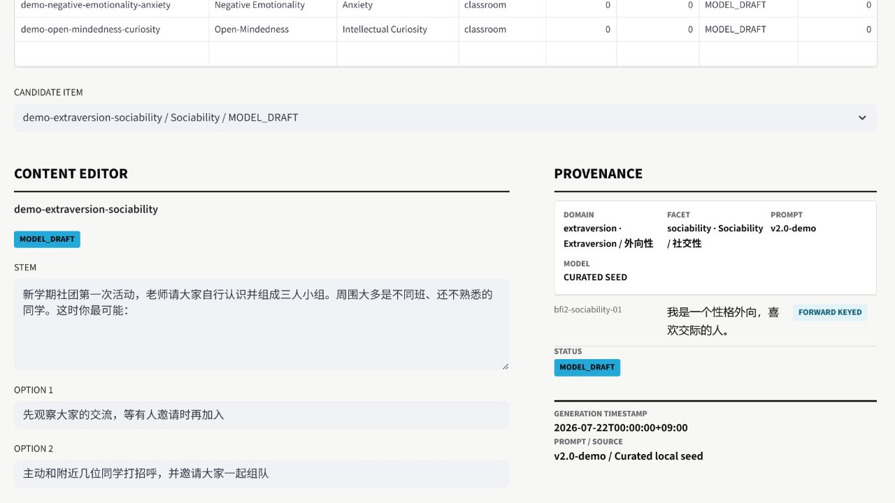
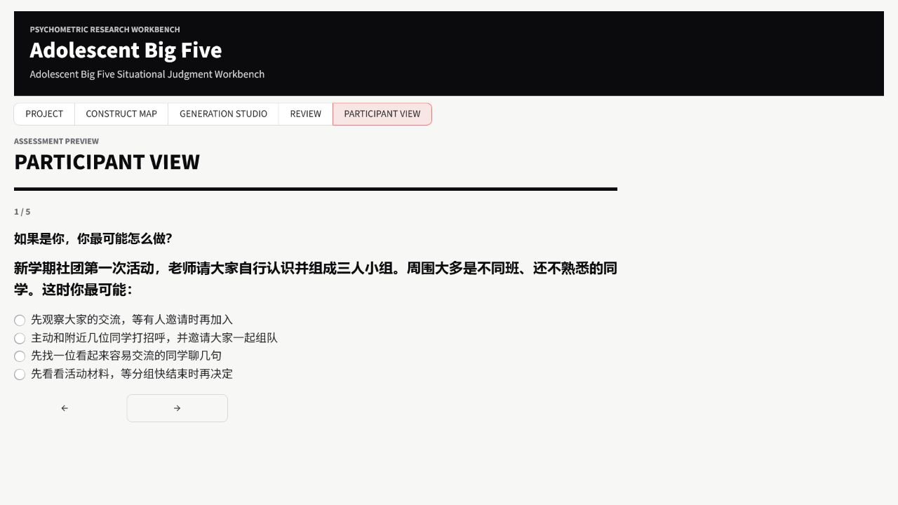

<div align="center">

# Adolescent Big Five Workbench

<p><strong>A traceable, human-reviewed workflow transforming established Big Five anchors into situational judgement item candidates for mainland Chinese adolescents aged 12-15.</strong></p>

<p>
  <a href="https://adolescent-big-five-workbench.streamlit.app/">Open the deployed app</a>
  · <a href="#research-workflow">Research workflow</a>
  · <a href="#中文使用说明">中文使用说明</a>
</p>

<p>
  
  
  
  
</p>

<table align="center">
  <tr>
    <td align="center"><strong>5 domains</strong></td>
    <td align="center"><strong>15 facets</strong></td>
    <td align="center"><strong>60 traceable anchors</strong></td>
  </tr>
</table>

</div>

> [!IMPORTANT]
> This workbench develops research candidates. It is **not a validated assessment**, diagnostic instrument, or personality-reporting service. Expert review, pilot testing, and empirical psychometric validation are required before research use.



## Research proposition

Classic personality inventories commonly ask respondents to endorse self-report statements. For early adolescents, an age-appropriate alternative is to observe choices within concrete, ecologically recognizable situations while preserving a clear link to the intended construct. The workbench explores that authoring problem; it does not assume that a situational format is automatically more valid.

The system makes item development an inspectable, staged workflow rather than a one-step prompting exercise. A model proposes structured material under an explicit construct specification and adolescent-context constraints. The researcher retains ownership of construct interpretation, evidence status, edits, approval, and the decision to advance a candidate toward piloting.

## From 2023 to the Current Workbench

The 2023 master's system focused on college students. The current reconstruction targets mainland Chinese adolescents aged 12-15 and rebuilds the authoring, anchor-linked traceability, review, and preview workflow around that population and research setting, alongside reference-only downloads.

This lineage describes the project's development history. It is not evidence that the current V2 workbench is superior to the earlier system, nor that its items or workflow are validated. No unverified historical sample sizes are claimed here.

## Research workflow



The facet is the generation unit. For each candidate, the workflow keeps the source direction, target behaviors, exclusions, likely confounds, scenario constraints, four response options, hidden scores, rationales, automated checks, and researcher edits available for inspection. This makes the path from source anchor to pilot candidate inspectable without treating generated text as measurement evidence. Review downloads are a separate, reference-only projection rather than an output of the pilot-candidate flow.

## Workbench tour

### 1. Construct Map

The Construct Map organizes five Big Five domains into 15 facets and connects them to 60 anchors. Each anchor retains its wording, scoring direction, domain and facet assignment, source identifier, and anchor identifier so a researcher can inspect what a generation request is intended to represent.

### 2. Generation Studio



Generation Studio turns one selected facet into a structured authoring request. It presents the construct specification and scenario blueprint, asks for a concrete adolescent situation with four options, runs quality checks, and stores the result as structured JSON. The supported generation metadata are the model identifier, prompt version, and constraint snapshot; the full rendered prompt is not stored.

### 3. Human Review



Human Review supports Chinese edits to the scenario and options, together with a named reviewer and review note. Evidence state and version history remain visible. Content approval is deliberately separate from pilot promotion: an item can be judged usable as content without implying that measurement evidence has been established.

### 4. Participant View



Participant View removes construct labels, hidden scores, rationales, and personality interpretation from the response surface. It currently shows all `PILOT_CANDIDATE` items when any exist; otherwise, it shows the first five reference items. Responses are session-only and no individual result is reported.

## Technical foundation

| Layer | Current implementation |
| --- | --- |
| Interface | Streamlit views for project context, construct inspection, generation, review, and participant preview |
| Workflow | Services that coordinate generation, checking, review transitions, and reference downloads |
| Records | Pydantic records for structured candidates, anchor links, evidence state, and history |
| Storage | Local JSON repository at `workspace_data/v2/projects/` with atomic file replacement |
| Model integration | OpenAI-compatible adapter with one repair attempt for invalid structured output |
| Review downloads | JSON and CSV projections containing reference items only, not live-generated candidates, even after review or promotion |

For a concise implementation inventory and module map, see [README_V2.md](README_V2.md). Run the repository test suite with:

```powershell
python -m pytest
```

## Current deployment boundary

Live generation requires model credentials and an access code. On Streamlit Community Cloud, repository storage is **ephemeral**; generated or reviewed records may not survive a restart, redeploy, or instance replacement.

The current Review downloads contain reference items only, not live-generated candidates, even after review or promotion. The current cloud download buttons are not a generated-candidate backup. Durable research work should use a local deployment and an external backup of `workspace_data/v2/projects/`.

The reference path remains available without model configuration. The workbench does not replace pilot studies or evidence for reliability, validity, and measurement invariance. It must not be used for diagnosis, high-stakes decisions, or individual-level inference.

## Research roadmap

The Big Five module is the first vertical of the workbench. Prospective extensions may examine other adolescent individual differences, executive function, psychopathology-related phenotypes, longitudinal studies, and potential neuroimaging integration. These are research directions only, not implemented or validated capabilities.

## License and research use

No open-source license is currently declared. Contact the repository owner before redistributing the code or deploying a derivative service. Any empirical use requires an appropriate study protocol, expert review, participant safeguards, and psychometric validation.

## 中文使用说明

### 1. 在线查看参考内容

打开[在线工作台](https://adolescent-big-five-workbench.streamlit.app/)。查看 Project、Construct Map、参考题目、审核元数据和 Participant View 不需要模型凭据。普通浏览不会调用模型，也不会消耗模型 token（does not consume model tokens）。

### 2. 使用模型生成候选题目

维护者需要配置 `OPENAI_API_KEY` 和 `LLM_MODEL`；当前会话还需要输入 `LIVE_ACCESS_CODE`。仅解锁访问权限不会调用模型，只有实际执行生成操作才会发出模型请求。生成前请选择 domain、facet 和 adolescent context。若使用兼容的自定义端点，可选配置 `OPENAI_BASE_URL`。

### 3. 审核并进入试测候选状态

1. 在 Human Review 中检查并编辑中文情境与四个选项。
2. 填写 reviewer 和 review note，记录本次判断的责任人与依据。
3. 执行 `APPROVE CONTENT`，确认内容层面可继续使用。
4. 再执行 `PROMOTE TO PILOT`，将状态推进为 `PILOT_CANDIDATE`。

这两个动作相互独立，避免把内容可用性与测量证据混为一谈。进入试测候选状态不代表信度、效度或跨群体等值性已经成立。

当前 Review 下载仅包含参考题目，不包含实时生成的候选题目；即使这些实时生成的候选题目之后已经过审核或推进至试测状态，也不会包含在下载中。

### 4. 在 Participant View 中查看

如果已有 `PILOT_CANDIDATE`，Participant View 会显示全部试测候选题目；否则显示前五个参考题目。作答仅保存在当前会话中，页面不会返回人格标签、分数或结果解释。

### 5. 本地运行

在 PowerShell 中克隆仓库、进入目录并安装依赖：

```powershell
git clone https://github.com/YaoZeLiu0417/LLM_Psychometric.git
Set-Location LLM_Psychometric
python -m pip install -r requirements-v2.txt
Copy-Item .env.example .env
```

按需编辑 `.env`，未使用的配置可以留空：

```dotenv
OPENAI_API_KEY=
LLM_MODEL=
OPENAI_BASE_URL=
LIVE_ACCESS_CODE=
```

启动工作台：

```powershell
powershell -ExecutionPolicy Bypass -File .\run_v2.ps1
```

然后访问 [http://localhost:8501](http://localhost:8501)。每个 workspace 只运行一个 Streamlit 进程。需要持久保存研究工作时，请使用本地部署，并在外部备份 `workspace_data/v2/projects/`。不要将 API key、访问码或其他 secrets 提交到版本库。
