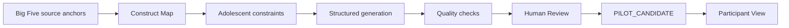

# GitHub Research Dossier README Implementation Plan

> **For agentic workers:** REQUIRED SUB-SKILL: Use superpowers:subagent-driven-development (recommended) or superpowers:executing-plans to implement this plan task-by-task. Steps use checkbox (`- [ ]`) syntax for tracking.

**Goal:** Publish a polished root GitHub README with a research-dossier narrative, accurate Chinese operating instructions, and four real workbench screenshots.

**Architecture:** Keep the work documentation-only: `README.md` owns the GitHub-facing narrative, `docs/assets/readme/` owns stable PNG captures, and focused pytest contracts prevent critical research claims, workflow instructions, and image paths from drifting. Existing application behavior and `README_V2.md` remain unchanged.

**Tech Stack:** GitHub-flavored Markdown, Mermaid, PNG screenshots from the Streamlit workbench, Python standard-library pytest contracts, Codex in-app browser capture.

---

## File Map

- Create `README.md`: public research dossier, feature tour, Chinese usage guide, boundaries, and roadmap.
- Create `tests/test_readme.py`: stable contract for required claims, URLs, commands, status flow, prohibited release language, and screenshot assets.
- Create `docs/assets/readme/construct-map.png`: first-screen research panorama.
- Create `docs/assets/readme/generation-studio.png`: generation workflow detail.
- Create `docs/assets/readme/review-workbench.png`: human-review detail.
- Create `docs/assets/readme/participant-view.png`: participant-facing detail.
- Keep `README_V2.md`: existing implementation note linked from the new README.

### Task 1: Establish the Root README Contract and Narrative

**Files:**
- Create: `tests/test_readme.py`
- Create: `README.md`

- [ ] **Step 1: Write the failing narrative and operations contract**

Create `tests/test_readme.py` with the following content:

```python
from __future__ import annotations

import struct
import zlib
from pathlib import Path

import pytest


ROOT = Path(__file__).resolve().parents[1]
README = ROOT / "README.md"
ASSET_DIR = ROOT / "docs" / "assets" / "readme"


def _documentation() -> str:
    assert README.is_file(), "The repository needs a root README.md"
    return README.read_text(encoding="utf-8")


def _png_size(path: Path) -> tuple[int, int]:
    data = path.read_bytes()
    assert data[:8] == b"\x89PNG\r\n\x1a\n", f"{path} is not a PNG"

    offset = 8
    width = height = None
    idat_parts: list[bytes] = []
    saw_iend = False
    chunk_index = 0

    while offset < len(data):
        assert len(data) - offset >= 12, f"{path} is truncated"
        chunk_length = struct.unpack(">I", data[offset : offset + 4])[0]
        chunk_type = data[offset + 4 : offset + 8]
        payload_start = offset + 8
        payload_end = payload_start + chunk_length
        chunk_end = payload_end + 4
        assert chunk_end <= len(data), f"{path} is truncated"

        payload = data[payload_start:payload_end]
        expected_crc = struct.unpack(">I", data[payload_end:chunk_end])[0]
        actual_crc = zlib.crc32(payload, zlib.crc32(chunk_type)) & 0xFFFFFFFF
        assert actual_crc == expected_crc, f"{path} has an invalid {chunk_type!r} CRC"

        if chunk_type == b"IHDR":
            assert chunk_index == 0 and width is None, f"{path} has an invalid IHDR"
            assert chunk_length == 13, f"{path} has an invalid IHDR"
            (
                width,
                height,
                bit_depth,
                color_type,
                compression_method,
                filter_method,
                interlace_method,
            ) = struct.unpack(">IIBBBBB", payload)
            valid_bit_depths = {
                0: {1, 2, 4, 8, 16},
                2: {8, 16},
                3: {1, 2, 4, 8},
                4: {8, 16},
                6: {8, 16},
            }
            assert width > 0 and height > 0, f"{path} has an invalid IHDR"
            assert bit_depth in valid_bit_depths.get(color_type, set()), (
                f"{path} has an invalid IHDR"
            )
            assert compression_method == 0, f"{path} has an invalid IHDR"
            assert filter_method == 0, f"{path} has an invalid IHDR"
            assert interlace_method in (0, 1), f"{path} has an invalid IHDR"
        elif chunk_type == b"IDAT":
            assert width is not None, f"{path} has IDAT before IHDR"
            idat_parts.append(payload)
        elif chunk_type == b"IEND":
            assert chunk_length == 0, f"{path} has an invalid IEND"
            assert width is not None, f"{path} has IEND before IHDR"
            assert idat_parts, f"{path} has no IDAT data"
            assert chunk_end == len(data), f"{path} has data after IEND"
            saw_iend = True
            offset = chunk_end
            break

        offset = chunk_end
        chunk_index += 1

    assert saw_iend, f"{path} is truncated (missing IEND)"

    decompressor = zlib.decompressobj()
    try:
        decompressor.decompress(b"".join(idat_parts))
        decompressor.flush()
    except zlib.error as exc:
        raise AssertionError(f"{path} has invalid compressed image data") from exc
    assert decompressor.eof, f"{path} has truncated compressed image data"
    assert not decompressor.unused_data, f"{path} has extra compressed image data"

    assert width is not None and height is not None
    return width, height


def test_root_readme_presents_the_research_dossier() -> None:
    documentation = _documentation()

    for expected in (
        "# Adolescent Big Five Workbench",
        "https://adolescent-big-five-workbench.streamlit.app/",
        "5 domains",
        "15 facets",
        "60 traceable anchors",
        "mainland Chinese adolescents aged 12-15",
        "From 2023 to the Current Workbench",
        "college students",
        "Construct Map",
        "Generation Studio",
        "Human Review",
        "Participant View",
        "not a validated assessment",
        "executive function",
        "psychopathology-related phenotypes",
        "neuroimaging",
    ):
        assert expected in documentation


def test_root_readme_documents_the_real_operating_contract() -> None:
    documentation = _documentation()

    for expected in (
        "## 中文使用说明",
        "APPROVE CONTENT",
        "PROMOTE TO PILOT",
        "PILOT_CANDIDATE",
        "OPENAI_API_KEY",
        "LLM_MODEL",
        "OPENAI_BASE_URL",
        "LIVE_ACCESS_CODE",
        "python -m pip install -r requirements-v2.txt",
        "powershell -ExecutionPolicy Bypass -File .\\run_v2.ps1",
        "http://localhost:8501",
        "Streamlit Community Cloud",
        "ephemeral",
        "reference items only",
        "not live-generated candidates, even after review or promotion",
        "workspace_data/v2/projects/",
        "model identifier, prompt version, and constraint snapshot",
        "Workflow / Human Review",
        "does not consume model tokens",
        "普通浏览不会调用模型，也不会消耗模型 token（does not consume model tokens）。",
        "README_V2.md",
    ):
        assert expected in documentation

    lowered = documentation.lower()
    assert "curated demo" not in lowered
    assert "live available" not in lowered
    assert "408 participants" not in lowered

    for inaccurate_claim in (
        'G --> I["JSON / CSV export"]',
        "preserves the model, prompt, and constraints",
        "source provenance",
        "Evidence / Human Reviewed",
        "including reviewed or promoted candidates",
        "not live-generated, reviewed, or promoted candidates",
    ):
        assert inaccurate_claim not in documentation
```

- [ ] **Step 2: Run the contract to verify it fails**

Run:

```powershell
python -m pytest tests/test_readme.py -q
```

Expected: FAIL with `The repository needs a root README.md`.

- [ ] **Step 3: Create the complete root README**

Create `README.md` with this content. Image references intentionally precede the asset task:

````markdown
<div align="center">

# Adolescent Big Five Workbench

**A traceable, human-reviewed workflow for transforming established Big Five anchors into situational judgement item candidates for mainland Chinese adolescents aged 12-15.**

[**Open the workbench**](https://adolescent-big-five-workbench.streamlit.app/) · [Research workflow](#research-workflow) · [中文使用说明](#中文使用说明)


| **5 domains** | **15 facets** | **60 traceable anchors** |
|:---:|:---:|:---:|
| Big Five structure | Facet-level generation | Anchor-linked traceability |

</div>

> [!IMPORTANT]
> This workbench develops research candidates. It is **not a validated assessment**, diagnostic instrument, or personality-reporting service. Candidate items require expert review, pilot testing, and empirical psychometric validation before research use.


## Research proposition

Classic personality questionnaires are efficient, but their abstract self-report statements can be difficult to translate into age-appropriate, ecologically meaningful observations. This workbench treats situational item development as an inspectable research workflow rather than a one-step prompt.

Each candidate preserves a chain from the source anchor and facet definition through observable indicators, adolescent scenario constraints, four behavioral response options, automated checks, and versioned human review. The model proposes structured research material; the researcher remains responsible for construct interpretation and evidence status.

## From 2023 to the Current Workbench

The project began as a 2023 master's research system focused on college students. The current reconstruction changes the target population to mainland Chinese adolescents aged 12-15 and rebuilds the earlier idea as a clearer authoring, anchor-linked traceability, review, and preview workflow, alongside reference-only downloads.

The earlier project establishes research lineage, not evidence that this version is superior or validated. Historical results and sample sizes are not restated without the original data record.

## Research workflow



The facet is the generation unit. Source direction, observable behavioral indicators, exclusions, possible confounds, scenario constraints, hidden option scores, concise rationales, checks, and human edits remain available for inspection. Review downloads are separate and contain reference items only; they are not an output of the pilot-candidate flow.

## Workbench tour

### 1. Construct Map

Navigate five domains, 15 facets, and 60 source anchors. Inspect construct definitions, behavioral indicators, exclusions, confounds, internal source identifiers, anchor identifiers, and forward/reverse direction before generating content.

### 2. Generation Studio


Generation is staged into a construct specification, adolescent scenario blueprint, four observable behavioral options, and quality checks. Live output uses schema-constrained JSON and stores the model identifier, prompt version, and constraint snapshot, not the full rendered prompt.

### 3. Human Review


Researchers can edit Chinese stems and options, record reviewer identity and notes, inspect anchor links and quality evidence, and preserve every decision as a review version. Content approval and pilot promotion are deliberately separate actions.

### 4. Participant View


Participant View removes construct labels, scoring keys, quality metadata, and personality interpretation. When pilot candidates exist, it shows all `PILOT_CANDIDATE` items; otherwise it shows the first five reference items.

## 中文使用说明

### 1. 在线查看参考内容

打开[在线工作台](https://adolescent-big-five-workbench.streamlit.app/)。无需模型密钥即可查看 PROJECT、CONSTRUCT MAP、已有参考题目、审核信息和 PARTICIPANT VIEW。普通浏览不会调用模型，也不会消耗模型 token（does not consume model tokens）。

### 2. 使用模型生成候选题目

在线生成需要维护者已配置 `OPENAI_API_KEY` 与 `LLM_MODEL`，并需要当前 Streamlit 会话的访问口令 `LIVE_ACCESS_CODE`。在 Generation Studio 中解锁会话本身不会调用模型；只有点击生成操作才会产生模型请求。

选择 domain、facet 和 adolescent context 后，系统依次生成构念说明、情境蓝图、四个行为选项与质量检查。`OPENAI_BASE_URL` 仅在使用兼容接口时配置。

### 3. 审核并进入试测候选状态

在 REVIEW 页面选择刚生成的题目：

1. 检查或修改中文题干与四个选项。
2. 填写 reviewer 和 review note。
3. 点击 `APPROVE CONTENT`，将内容标记为已完成人工审核。
4. 再点击 `PROMOTE TO PILOT`，将其转为 `PILOT_CANDIDATE`。

两个动作分离是为了避免“内容看起来可用”被误解为“已经具备测量学证据”。

当前 Review 下载仅包含参考题目，不包含实时生成的候选题目；即使这些实时生成的候选题目之后已经过审核或推进至试测状态，也不会包含在下载中。

### 4. 在 Participant View 中查看

进入 PARTICIPANT VIEW。只要当前项目中存在 `PILOT_CANDIDATE`，页面就展示全部试测候选题目；如果不存在，则回退到前五个参考题目。预览作答只保留在当前会话中，不生成个人结果。

### 5. 本地运行

```powershell
git clone https://github.com/YaoZeLiu0417/LLM_Psychometric.git
Set-Location LLM_Psychometric
python -m pip install -r requirements-v2.txt
Copy-Item .env.example .env
```

按需填写根目录 `.env`：

```dotenv
OPENAI_API_KEY=
LLM_MODEL=
OPENAI_BASE_URL=
LIVE_ACCESS_CODE=
```

启动工作台：

```powershell
powershell -ExecutionPolicy Bypass -File .\run_v2.ps1
```

打开 `http://localhost:8501`。一次工作区只运行一个 Streamlit 服务进程。需要持久保存研究工作时，请使用本地部署，并在外部备份 `workspace_data/v2/projects/`；密钥和访问口令不得提交到 Git。

## Technical foundation

| Layer | Responsibility |
|---|---|
| Streamlit views | Research navigation, authoring, review, preview, and reference downloads |
| Workflow services | Generation stages, status transitions, version conflict checks |
| Pydantic records | Typed constructs, scenarios, options, checks, and review history |
| JSON repository | Local project state at `workspace_data/v2/projects/` with atomic file replacement |
| Model adapter | OpenAI-compatible structured generation with one repair attempt |
| Review downloads | JSON and CSV projections containing reference items only, not live-generated candidates, even after review or promotion |

Detailed runtime notes remain in [README_V2.md](README_V2.md). Run the repository checks with:

```powershell
python -m pytest
```

## Current deployment boundary

- Live generation requires configured model credentials and a valid session access code.
- Streamlit Community Cloud storage is **ephemeral**. Generated and reviewed items may disappear after a restart or redeployment.
- Current Review downloads contain reference items only, not live-generated candidates, even after review or promotion.
- Durable research work should use a local deployment and an external backup of `workspace_data/v2/projects/`; current cloud download buttons are not a generated-candidate backup.
- Missing model configuration affects generation only; the reference research path remains available.
- Model output, automated checks, and human review do not replace pilot testing, reliability or validity evidence, or measurement-invariance analysis.
- Do not use this system for diagnosis, high-stakes decisions, or individual personality inference.

## Research roadmap

The current Big Five module is a first research vertical. The same traceable authoring and review pattern could support future adolescent modules for individual differences, executive function, psychopathology-related phenotypes, longitudinal studies, and potential neuroimaging integration.

These are prospective research directions, not implemented or validated capabilities.

## License and research use

No open-source license has yet been declared for this repository. Contact the repository owner before redistribution or research deployment. Any empirical use requires an appropriate study protocol, expert item review, participant safeguards, and psychometric validation.
````

- [ ] **Step 4: Run the narrative contract and verify it passes**

Run:

```powershell
python -m pytest tests/test_readme.py -q
```

Expected: the two narrative/operations tests PASS. The asset test does not exist yet.

- [ ] **Step 5: Commit the narrative and contract**

```powershell
git add README.md tests/test_readme.py
git commit -m "docs: add research dossier README"
```

### Task 2: Capture and Contract the Real Workbench Assets

**Files:**
- Modify: `tests/test_readme.py`
- Create: `docs/assets/readme/construct-map.png`
- Create: `docs/assets/readme/generation-studio.png`
- Create: `docs/assets/readme/review-workbench.png`
- Create: `docs/assets/readme/participant-view.png`

- [ ] **Step 1: Add the failing PNG and screenshot asset contracts**

Append to `tests/test_readme.py`:

```python
def test_png_size_rejects_truncated_file(tmp_path: Path) -> None:
    truncated_path = tmp_path / "truncated.png"
    truncated_path.write_bytes((ASSET_DIR / "construct-map.png").read_bytes()[:24])

    with pytest.raises(AssertionError, match="truncated"):
        _png_size(truncated_path)


def test_root_readme_assets_are_real_consistent_png_captures() -> None:
    documentation = _documentation()
    asset_names = (
        "construct-map.png",
        "generation-studio.png",
        "review-workbench.png",
        "participant-view.png",
    )
    dimensions: set[tuple[int, int]] = set()

    for asset_name in asset_names:
        relative_path = f"docs/assets/readme/{asset_name}"
        assert relative_path in documentation
        asset_path = ASSET_DIR / asset_name
        assert asset_path.is_file(), f"Missing README asset: {asset_name}"
        width, height = _png_size(asset_path)
        assert width >= 1000
        assert height >= 650
        dimensions.add((width, height))

    assert len(dimensions) == 1, "README screenshots must share one viewport"
```

- [ ] **Step 2: Run the asset contract to verify it fails**

Run:

```powershell
python -m pytest tests/test_readme.py::test_root_readme_assets_are_real_consistent_png_captures -q
```

Expected: FAIL with `Missing README asset: construct-map.png`.

- [ ] **Step 3: Start one clean local Streamlit process**

Run from the repository root:

```powershell
$readmeServer = Start-Process -FilePath python -ArgumentList "-m","streamlit","run","app_v2.py","--server.port","8503","--server.headless","true" -PassThru -WindowStyle Hidden
```

Verify:

```powershell
Invoke-WebRequest http://localhost:8503/_stcore/health -UseBasicParsing
```

Expected: HTTP 200 with body `ok`.

- [ ] **Step 4: Capture four screenshots from the same browser tab and viewport**

Use the Codex in-app browser with `http://localhost:8503`. Keep its default desktop viewport unchanged for every capture. Use one tab, wait for Streamlit to finish rendering after each navigation, and save `tab.screenshot({fullPage:false})` bytes with `node:fs/promises`:

```javascript
globalThis.readmeFs = await import("node:fs/promises");
globalThis.readmeAssetRoot = "D:/LLM_Psychometric/docs/assets/readme";
await readmeFs.mkdir(readmeAssetRoot, { recursive: true });

await readmeFs.writeFile(
  `${readmeAssetRoot}/construct-map.png`,
  await tab.screenshot({ fullPage: false })
);
```

Repeat the same write after navigating to each exact global navigation label:

```text
CONSTRUCT MAP      -> construct-map.png
GENERATION STUDIO  -> generation-studio.png
REVIEW             -> review-workbench.png
PARTICIPANT VIEW   -> participant-view.png
```

Before each click, use a fresh DOM snapshot when necessary, build the locator from the visible navigation label, confirm `count() == 1`, click, and then confirm the expected page heading before taking the screenshot. Do not unlock live generation or enter any credential.

- [ ] **Step 5: Inspect every capture for content and secrecy**

View all four PNG files. Confirm:

- the full workbench content is visible and nonblank;
- Construct Map labels are legible and inside the wheel;
- Generation Studio shows seeded/reference content without a spinner or error;
- Review shows the editor, evidence status, and anchor-linked traceability region;
- Participant View shows Chinese item content without trait labels or scores;
- no access code, API key, environment value, local path, browser account, or notification appears;
- all files have exactly the same pixel dimensions.

If a capture fails any check, navigate back to that page and overwrite only that PNG from the unchanged tab viewport.

- [ ] **Step 6: Stop the local screenshot server**

Run:

```powershell
Stop-Process -Id $readmeServer.Id
```

Expected: port 8503 no longer listens.

- [ ] **Step 7: Run the asset contract and verify it passes**

Run:

```powershell
python -m pytest tests/test_readme.py -q
```

Expected: all three README contract tests PASS.

- [ ] **Step 8: Commit the screenshot assets**

```powershell
git add tests/test_readme.py docs/assets/readme
git commit -m "docs: add workbench README captures"
```

### Task 3: Verify the GitHub Rendering Contract and Repository

**Files:**
- Modify if required by verification: `README.md`
- Modify if required by verification: `tests/test_readme.py`

- [ ] **Step 1: Run whitespace and secret-oriented diff checks**

Run:

```powershell
git diff --check master...HEAD
git diff --name-only master...HEAD
rg -n "sk-[A-Za-z0-9]|LIVE_ACCESS_CODE=.+|OPENAI_API_KEY=.+|curated demo|live available|408 participants" README.md docs/assets/readme tests/test_readme.py
rg -n "reference items only|not live-generated candidates, even after review or promotion|workspace_data/v2/projects/|model identifier, prompt version, and constraint snapshot|Workflow / Human Review" README.md tests/test_readme.py
rg -n "G --> I|preserves the model, prompt, and constraints|source provenance|Evidence / Human Reviewed|exports for inspection and retention" README.md
```

Expected: no whitespace errors, exactly the planned documentation/test files plus approved spec/plan changes, no credential or prohibited-copy match, every durable-boundary phrase present, and no inaccurate export, prompt, source, or badge wording in the README. Matches inside explicit forbidden-string assertions are acceptable in `tests/test_readme.py`.

- [ ] **Step 2: Run focused and complete verification**

Run:

```powershell
python -m pytest tests/test_readme.py -q
python -m pytest
```

Expected: all README contract tests PASS and the complete repository suite exits 0.

- [ ] **Step 3: Push the branch for a real GitHub render check**

Run:

```powershell
git push -u origin codex/github-readme
```

Open the branch README on GitHub and inspect desktop and narrow layouts. Confirm that Mermaid renders, all four images load, badge text is readable, headings create a useful outline, Chinese characters display correctly, and no image dominates the page beyond its section.

- [ ] **Step 4: Correct only verified render issues**

If the GitHub render exposes a concrete issue, make the smallest documentation-only correction, rerun `python -m pytest tests/test_readme.py -q`, and commit:

```powershell
git add README.md tests/test_readme.py docs/assets/readme
git commit -m "docs: polish GitHub README rendering"
git push
```

If no correction is needed, do not create an empty commit.

- [ ] **Step 5: Publish through the repository workflow**

Create a ready pull request whose body summarizes the research-dossier narrative, Chinese usage guide, real screenshots, deployment boundaries, and verification results. Merge it with the repository's normal merge strategy after checks succeed, then verify that the root repository URL renders the new README.
